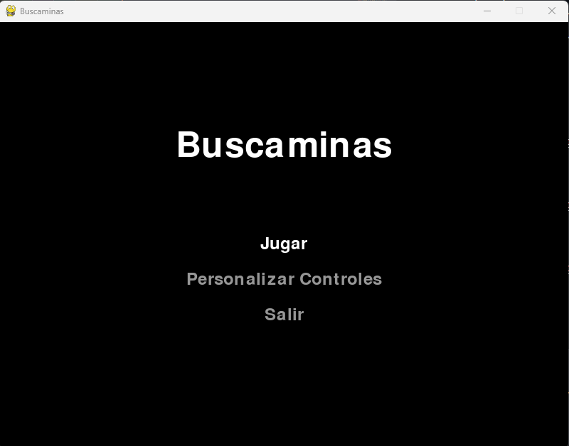
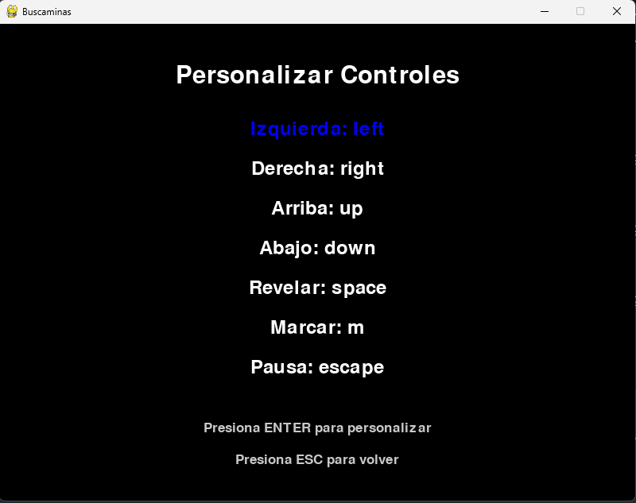
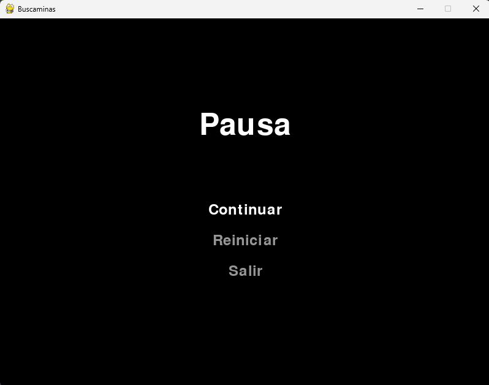
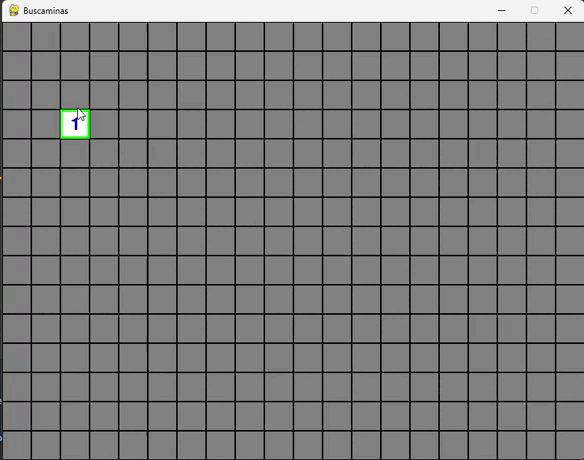

# Buscaminas en Python

Este proyecto es una implementación del clásico juego Buscaminas utilizando Python y Pygame.

## Características

- Interfaz gráfica usando Pygame
- Tablero de juego personalizable
- Controles configurables
- Menú principal interactivo
- Pantallas de victoria y derrota
- Opción para reiniciar el juego o volver al menú principal

## Capturas

### Menu principal

### Controles

### Menu de pausa

### Juego

## Requisitos

- Python 3.x
- Pygame

## Cómo jugar

1. Ejecuta el script principal:
2. Usa el menú principal para iniciar una nueva partida o personalizar los controles.

3. En el juego:
   - Clic izquierdo para revelar una celda
   - Clic derecho para marcar una posible mina
   - Revela todas las celdas sin minas para ganar
   - ¡Cuidado con las minas!

## Controles predeterminados

- Flechas de dirección: Mover el cursor
- Espacio: Revelar celda
- M: Marcar/Desmarcar celda
- ESC: Pausa
